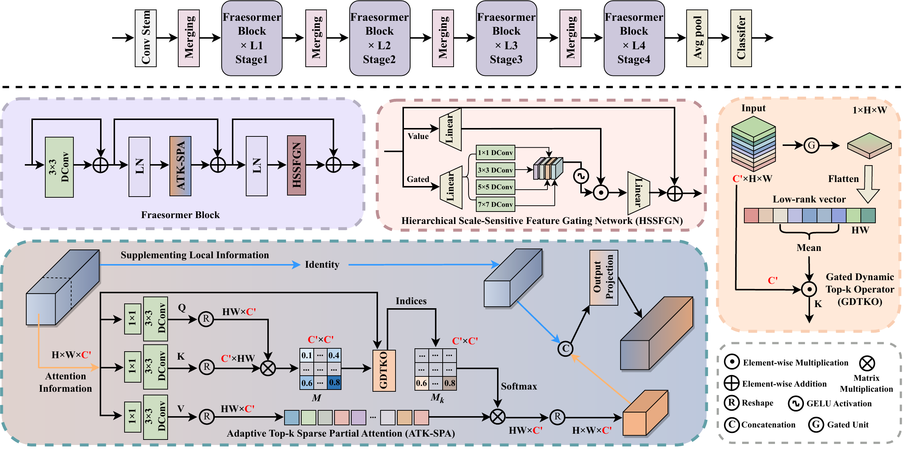
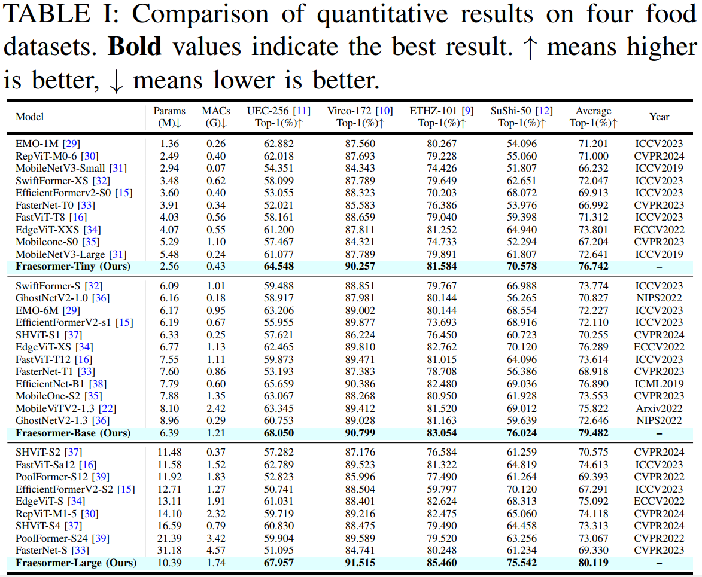
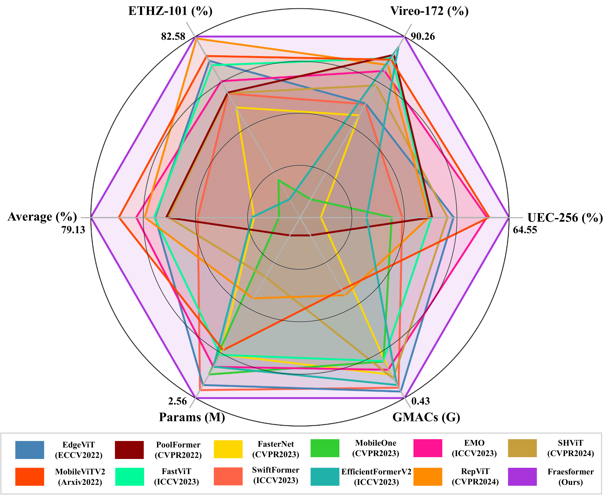

<div align="center">
<p align="center">  </p>
</div>

# Fraesormer: Learning Adaptive Sparse Transformer for Efficient Food Recognition

#### 🔥🔥🔥 News


- **2024-06-09:** This repo is released (Private).

---

> **Abstract:** In recent years, Transformer has witnessed significant progress in food recognition. However, most existing
approaches still face two critical challenges in lightweight food
recognition: (1) the quadratic complexity and redundant feature
representation from interactions with irrelevant tokens; (2)
static feature recognition and single-scale representation, which
overlook the unstructured, non-fixed nature of food images
and the need for multi-scale features. To address these, we
propose an adaptive and efficient sparse Transformer architecture
(Fraesormer) with two core designs: Adaptive Top-k Sparse Partial
Attention (ATK-SPA) and Hierarchical Scale-Sensitive Feature
Gating Network (HSSFGN). ATK-SPA uses a learnable Gated
Dynamic Top-K Operator (GDTKO) to retain critical attention
scores, filtering low query-key matches that hinder feature
aggregation. It also introduces a partial channel mechanism
to reduce redundancy and promote expert information flow,
enabling local-global collaborative modeling. HSSFGN employs
gating mechanism to achieve multi-scale feature representation,
enhancing contextual semantic information. Extensive experiments
show that Fraesormer outperforms state-of-the-art methods.



---

## Dependencies

- Python 3.8
- PyTorch 1.11.0+cu113

#### Setup
```bash
conda create -n fraesormer python=3.8
conda activate fraesormer
conda install pytorch==1.11.0 torchvision==0.12.0 torchaudio==0.11.0 cudatoolkit=11.3 -c pytorch
pip install -r requirements.txt
```

## Contents

1. [Datasets](#datasets)
1. [Training](#training)
1. [Testing](#testing)
1. [Results](#results)
1. [Citation](#citation)
1. [Acknowledgements](#acknowledgements)

## <a name="datasets"></a> Datasets

Used training and testing sets can be downloaded as follows:

| Datasets       |                                                              Content | Link |
|:---------------|---------------------------------------------------------------------:|:----:|
| ETHZ Food-101  | ETHZ Food-101 contains 101 categories with a total of 101,000 images |      |
| Vireo Food-172 |         Vireo Food-172 consists of 172 categories with 67,288 images |      |
| UEC Food-256   |              UEC Food-256 includes 256 categories with 31,395 images |      |
| SuShi-50       |                    SuShi-50 contains 50 categories with 3,963 images |      |

Download training and testing datasets and put them into the corresponding folders of `datasets/`.


## <a name="training"></a> Training


Download the all food dataset and structure the data as follows:
```
/path/to/datasets/
  ETHZ Food-101/
    train/
      class1/
        img1.jpeg
      class2/
        img2.jpeg
    validation/
      class1/
        img3.jpeg
      class2/
        img4.jpeg
  Vireo Food-172/
    train/
      class1/
        img1.jpeg
      class2/
        img2.jpeg
    validation/
      class1/
        img3.jpeg
      class2/
        img4.jpeg
  UEC Food-256/        
  SuShi-50/
```

To train Fraesormer models, follow the respective command below:
#### ETHZ Food-101
<details>
<summary>
Fraesormer-Tiny
</summary>

```
python main.py --model Fraesormer-Tiny --data-set ETHZ_Food-101 --data-path $PATH_TO_ETHZ_Food-101 --output_dir $PATH_Result_ETHZ_Food-101
```
</details>

<details>
<summary>
Fraesormer-base
</summary>

```
python main.py --model Fraesormer-Base --data-set ETHZ_Food-101 --data-path $PATH_TO_ETHZ_Food-101 --output_dir $PATH_Result_ETHZ_Food-101
```
</details>

<details>
<summary>
Fraesormer-Large
</summary>

```
python main.py --model Fraesormer-Large --data-set ETHZ_Food-101 --data-path $PATH_TO_ETHZ_Food-101 --output_dir $PATH_Result_ETHZ_Food-101
```
</details>

#### Vireo Food-172
<details>
<summary>
Fraesormer-Tiny
</summary>

```
python main.py --model Fraesormer-Tiny --data-set Vireo_Food-172 --data-path $PATH_TO_Vireo_Food-172 --output_dir $PATH_Result_Vireo_Food-172
```
</details>

<details>
<summary>
Fraesormer-base
</summary>

```
python main.py --model Fraesormer-Base --data-set Vireo_Food-172 --data-path $PATH_TO_Vireo_Food-172 --output_dir $PATH_Result_Vireo_Food-172
```
</details>

<details>
<summary>
Fraesormer-Large
</summary>

```
python main.py --model Fraesormer-Large --data-set Vireo_Food-172 --data-path $PATH_TO_Vireo_Food-172 --output_dir $PATH_Result_Vireo_Food-172
```
</details>

#### UEC Food-256
<details>
<summary>
Fraesormer-Tiny
</summary>

```
python main.py --model Fraesormer-Tiny --data-set UEC_Food-256 --data-path $PATH_TO_UEC_Food-256 --output_dir $PATH_Result_UEC_Food-256
```
</details>

<details>
<summary>
Fraesormer-base
</summary>

```
python main.py --model Fraesormer-Base --data-set UEC_Food-256 --data-path $PATH_TO_UEC_Food-256 --output_dir $PATH_Result_UEC_Food-256
```
</details>

<details>
<summary>
Fraesormer-Large
</summary>

```
python main.py --model Fraesormer-Large --data-set UEC_Food-256 --data-path $PATH_TO_UEC_Food-256 --output_dir $PATH_Result_UEC_Food-256
```
</details>

#### SuShi-50
<details>
<summary>
Fraesormer-Tiny
</summary>

```
python main.py --model Fraesormer-Tiny --data-set SuShi-50 --data-path $PATH_TO_SuShi-50 --output_dir $PATH_Result_SuShi-50
```
</details>

<details>
<summary>
Fraesormer-base
</summary>

```
python main.py --model Fraesormer-Base --data-set SuShi-50 --data-path $PATH_TO_SuShi-50 --output_dir $PATH_Result_SuShi-50
```
</details>

<details>
<summary>
Fraesormer-Large
</summary>

```
python main.py --model Fraesormer-Large --data-set SuShi-50 --data-path $PATH_TO_SuShi-50 --output_dir $PATH_Result_SuShi-50
```
</details>


## <a name="testing"></a> Testing
Run the following command to evaluate a pre-trained Fraesormer-Tiny on UEC_Food-256 validation set with a single GPU:
```bash
python main.py --eval --model Fraesormer-Tiny --resume ./Fraesormer-Tiny.pth --data-path $PATH_TO_UEC_Food_256
```


## <a name="results"></a> Results

We achieve state-of-the-art performance. Detailed results can be found in the paper.

<details>
<summary>Quantitative Comparisons (click to expand)</summary>

- Results in Table 1 (main paper)

<p align="center">
  
</p>

- Results in Figure 1 (main paper)

<p align="center">
  
</p>


</details>


## <a name="citation"></a> Citation

If you find the code helpful in your research or work, please cite the following paper(s).

```

```


## <a name="acknowledgements"></a> Acknowledgements

We sincerely appreciate [SHViT](https://github.com/ysj9909/SHViT), [Swin Transformer](https://github.com/microsoft/swin-transformer), [LeViT](https://github.com/facebookresearch/LeViT), [pytorch-image-models](https://github.com/rwightman/pytorch-image-models), [EfficientViT](https://github.com/microsoft/Cream/tree/main/EfficientViT) and [PyTorch](https://github.com/pytorch/pytorch) for their wonderful implementations.
